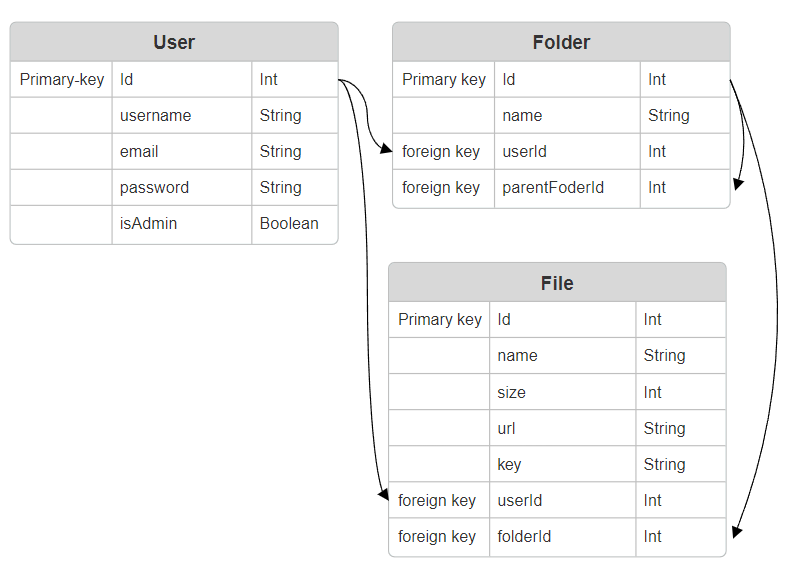

# File Manager

A simple API to store and manage your folders and files

##  database schema



## Set up

To set up the project locally, follow these steps:

1. **Clone the repository**

   ```bash
   git clone https://github.com/shreyash-daundkar/File-Manager.git
   cd File-Manager

2. **Install dependencies**
   
   ```bash
   npm install

3. **Environment Variables**

   Rename .env.example to .env and fill values of all keys.

5. **Migrate the Database**
   ```bash
   npx prisma migrate dev

6. **Generate Prisma Client**
   ```bash
   npx prisma generate

## Running & Testing the Application

1. **Start the Development Server**
   
   ```bash
   npm start

3. **Import 'postman-collection.json' file in your postman app**

4. **Test requests in postman collection**
